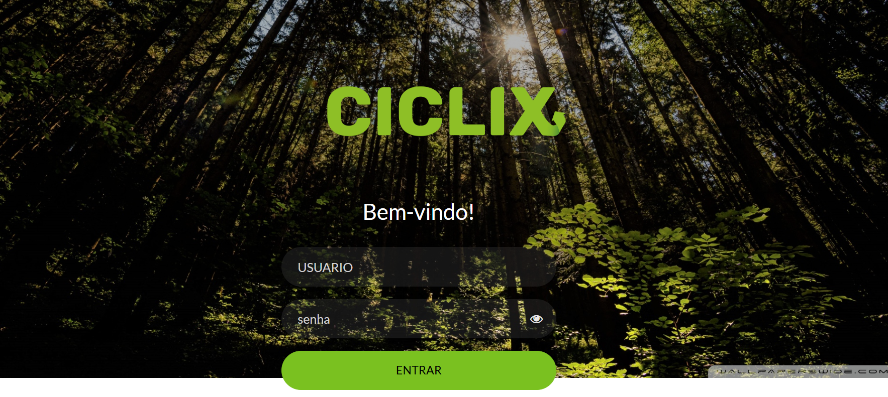
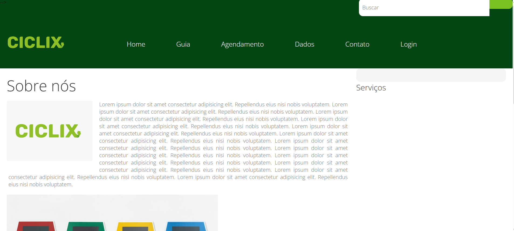
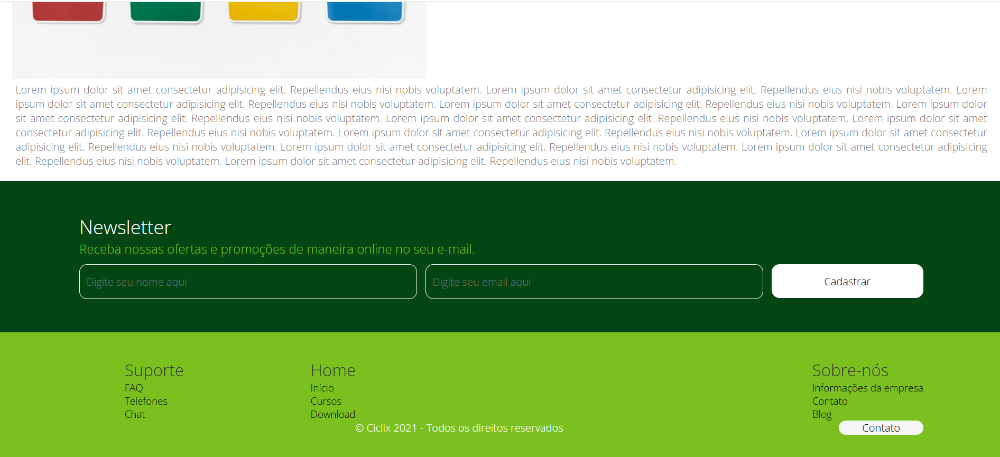
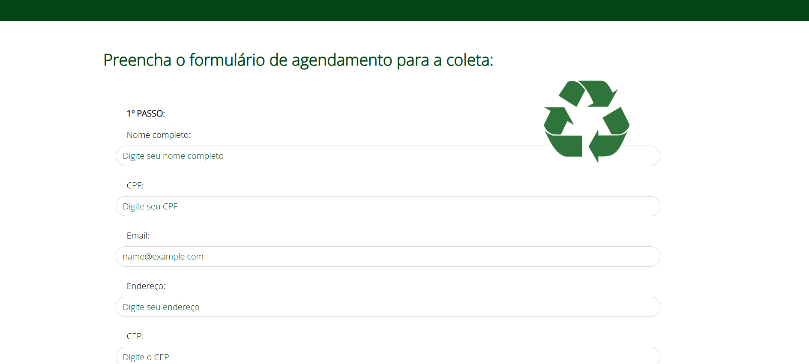
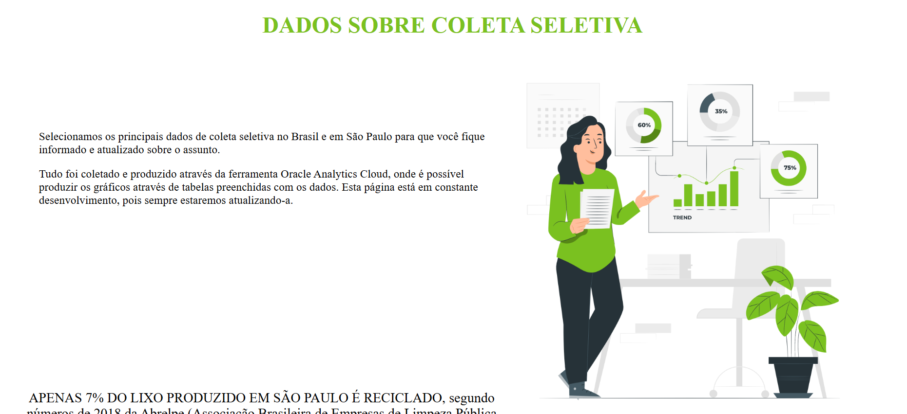

<h1 align="center" style="font-weight: bold;">Ciclix 💻</h1>

 <a href="#tech">Technologies</a> • 
 <a href="#started">Getting Started</a> 

    <b>Primeira aplicação web criada em 2021 no Instituto PROA. A aplicação visa otimizar a coleta de materiais recicláveis no bairro, conectando moradores a serviços de transporte direto para centros de reciclagem.</b>

<h2 id="layout">🎨 Layout</h2>

    
    
    
    
    
   

<h2 id="technologies">💻 Technologies</h2>
<ul>
 <li>HTML</li>
 <li>CSS</li>
 <li>Javascript</li>
</ul>

<h2 id="started">🚀 Getting started</h2>

<h3>Prerequisites</h3>
<ul>
 <li>NodeJS</li>
 <li>Git</li>
</ul>

<h3>Cloning</h3>

How to clone your project

git clone https://github.com/Raissamarq/Primeiro-Projeto-Ciclix-2021-.git

<h3>Starting</h3>

Inicie pelo index.html

